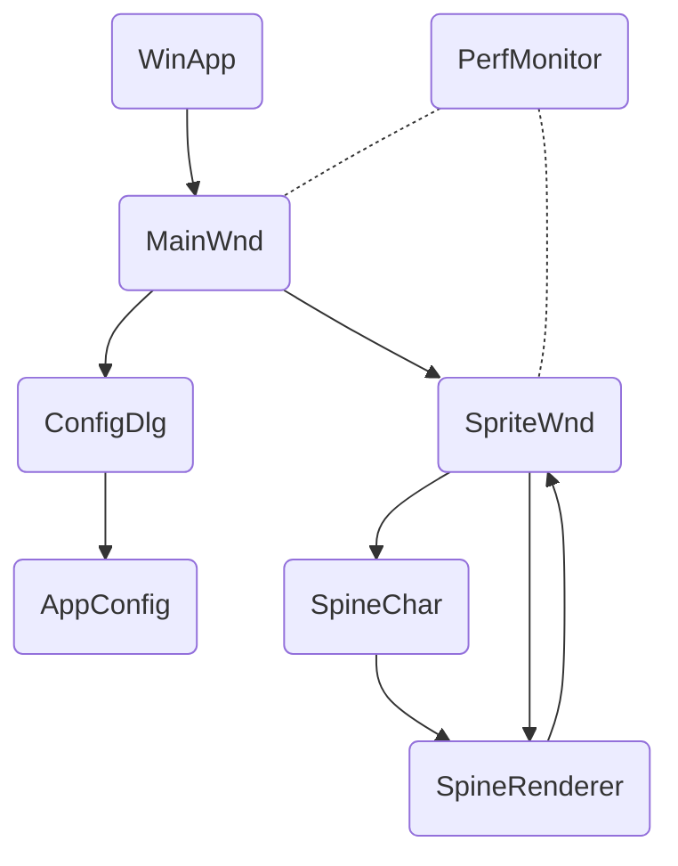

# DesktopSprite | Developer

[←README](README.md)

这是关于项目代码结构和一些功能实现说明, 普通用户酌情阅读.

## 环境

- `Win10+`
- `Visual Studio 2022`
- `C++14`
- [`spine-runtime`](https://github.com/EsotericSoftware/spine-runtimes/tree/3.6)
- [`jsoncpp`](https://github.com/open-source-parsers/jsoncpp)

其中 `spine-runtime` 和 `jsoncpp` 均是以源码方式引入并编译的, 内部有一些相应的适配性修改.

`spine-runtime` 版本固定了是 `v3.6.53`, 所以几乎只支持碧蓝航线导出的小人资源.

## 代码结构



(仅展示了一部分核心关系)

## 注意事项

### 性能监视器部分

性能数据使用 [PDH](https://docs.microsoft.com/en-us/windows/win32/perfctrs/performance-counters-portal) 进行收集, 数据与任务管理器看到的会有一些不同, 但是和性能监视器 [perfmon.msc](https://docs.microsoft.com/en-us/windows-server/administration/windows-commands/perfmon) 的数据是一样的.

有关数据收集的内容见 [`perfmonitor.cpp`](DesktopSprite/src/ds/perfmonitor.cpp).

### 桌宠部分

桌宠使用 2D 图形库绘制, 具体实现原理参考 [spine-c 运行时文档](http://zh.esotericsoftware.com/spine-c), 标准实现需要使用纹理映射等计算机图形学操作~但是我不会~, 所以纹理映射是通过 2D 库的纹理笔刷来实现的.

创建纹理笔刷之后, 在绘制顶点三角形时, 需要自己手动计算纹理到模型的仿射矩阵, 然后设置笔刷的变换矩阵, 就能完成纹理映射. 关键函数是这个 `GetAffineMatrix`:

```cpp
void GetAffineMatrix(
    float x1, float y1, float x2, float y2, float x3, float y3, 
    float u1, float v1, float u2, float v2, float u3, float v3, 
    Matrix* m
);
```

能够计算两个平面三角形 `UV` 到 `XY` 的仿射矩阵. 与渲染有关的详细实现见 [`spinechar.cpp`](DesktopSprite/src/ds/spinechar.cpp).
