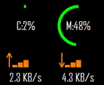
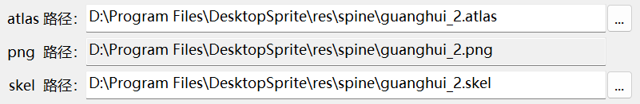

# DesktopSprite

[用户手册](README.user.md) | [开发手册](README.dev.md)

这是一个适用于 `Windows` 系统下的桌面精灵, 目前已在 `Win10`, `Win11` 下基本测试通过.

- 轻量的性能监视器: 可以显示电脑占用和网速监视浮窗

- 可自定义桌宠: 支持基于 `spine v3.6.53` 导出的碧蓝航线全角色小人动画

## 安装与使用

### 安装

前往 [Release](https://github.com/ww-rm/DesktopSprite/releases) 下载 `Latest` 版本的 `zip` 压缩包, 解压后双击运行里面的 `DesktopSprite.msi` 安装文件进行安装, 可以自定义安装位置.

安装完成后, 开始菜单和桌面都会出现程序启动图标. 双击运行, 通知栏会有程序图标, 首次运行桌面默认会显示自带的碧蓝小人角色, 且有一个性能浮窗.

### 更换角色

右键通知区域程序图标, 可以进入设置界面, 设置对应的 `atlas` 和 `skel/json` 文件, 然后应用/确定设置即可完成更换.

需要注意 `*.atlas`, `*.png`, `*.skel/*.json` 三份文件需要互相匹配, 且 `*.atlas` 和 `*.png` 文件名必须相同 (选择 `atlas` 的时候会自动填入 `png` 文件).

### 更多功能

程序内还有一些附带的小功能和更多细致的调节参数, 详细说明见[用户手册](README.user.md).

此处附一下自己导出的角色小人资源, 日期截止到 `2023-03-29`, [点我获取资源]().

## 关于

- 一些资源的出处
  - [图标文件](https://github.com/ww-rm/DesktopSprite/blob/main/DesktopSprite/res/image/appicon_dark.png): 来自: [凪白みと](https://www.pixiv.net/artworks/56065927)
  - [默认气泡图标](https://github.com/ww-rm/DesktopSprite/blob/main/DesktopSprite/res/image/timealarm.png) 来自: [むーらん@お仕事募集中](https://www.pixiv.net/artworks/67763478)

---

*如果你觉得这个项目不错请给个 Star⭐, 并分享给更多人知道. :)*

*If you think this project is helpful to you, plz star it and let more people see it. :)*
