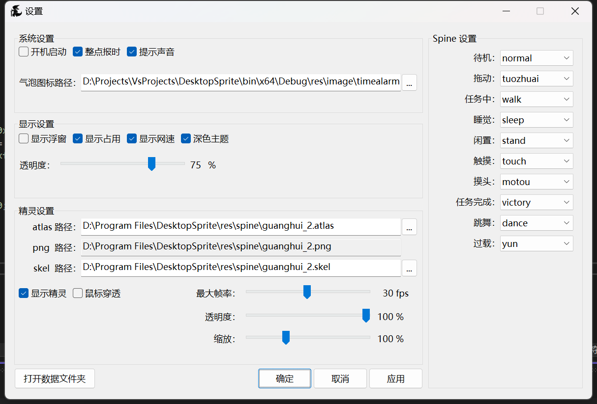

# DesktopSprite | User

[←README](README.md)

这是关于程序的详细功能和使用方法.

## 设置面板

### 系统设置

- 开机启动: 程序是否开机启动
- 整点报时: 一个小功能, 可以在整点时间弹出通知提醒
- 提示声音: 整点报时是否有声音
- 气泡图标路径: 整点报时气泡通知使用的图标

### 显示设置

这部分的设置是针对性能浮窗的.

- 显示浮窗: 是在桌面显示浮窗还是隐藏到通知区域图标使用鼠标悬停显示
- 显示占用: 是否在浮窗上显示处理器和内存占用百分比
- 显示网速: 是否在浮窗上显示上传和下载速度
- 深色主题: 设置浮窗主题颜色
- 透明度: 设置浮窗透明度百分比, 0 为完全透明, 100 为完全不透明

### 精灵设置

这部分的设置是针对桌宠的

- atlas, png, skel 路径: 选择要使用的 SD 小人模型, 三个文件要互相匹配
- 显示精灵: 是否在桌面上显示桌宠, 不显示的情况下不会有桌宠的资源占用
- 鼠标穿透: 是否让桌宠鼠标穿透, 穿透情况下桌宠无视鼠标和键盘输入
- 最大帧率: 设置桌宠的渲染帧率, 对电脑性能有较高影响
- 透明度: 设置桌宠透明度, 配合鼠标穿透可以设置挂件效果
- 缩放: 设置桌宠的大小

### Spine 设置

该部分设置桌宠动画小人不同事件和动画的映射关系, 可选内容由加载的 spine 模型决定.

- 待机: 无操作的普通情况
- 拖动: 鼠标拖动桌宠时触发
- 任务中: 没想好
- 睡觉: 电脑无输入闲置一段时间后触发
- 闲置: 电脑低负载时随机触发
- 触摸: 单击桌宠触发
- 摸头: 鼠标中键下滚
- 任务完成: 任务结束后, 和任务中是连着的
- 跳舞: 鼠标中键上滚
- 过载: 电脑高负载时随机触发

### 按钮

- 打开数据文件夹: 打开程序数据文件所在的文件夹

## 右键菜单

右键菜单有两个, 一个是浮窗/通知区域图标的, 另一个是桌宠的, 大部分选项都是设置面板里有的, 是快捷操作.

- 精灵复位: 用来预防一些未知的特殊情况, 如一些不可知的显示器分辨率问题导致的精灵错位消失, 点击之后精灵会回到原点, 屏幕的正下方.

## 配置文件

⚠️不建议直接操作配置文件! ⚠️

⚠️不建议直接操作配置文件! ⚠️

⚠️不建议直接操作配置文件! ⚠️

点击 "打开数据文件夹" 后, 可以看到数据文件夹里有一份 `config.json`, 里面以 `json` 格式存储了所有的设置面板可见的配置信息.

## 注意事项

- 不建议帧率调太高, 会使电脑耗电显著增加, 或者风扇抽风
- 如果不慎出了一些和配置有关的问题, 比如设置了错误的内容导致程序崩了/打不开, 直接打开数据文件夹, 关闭程序并删除 `config.json` 后重启程序, 即可让程序使用默认配置运行

## 资源拆包

这里不提供资源拆包方法, 请自行百度 `碧蓝航线`, `SD小人`, `拆包`, `AssetStudio` 等有关内容.
